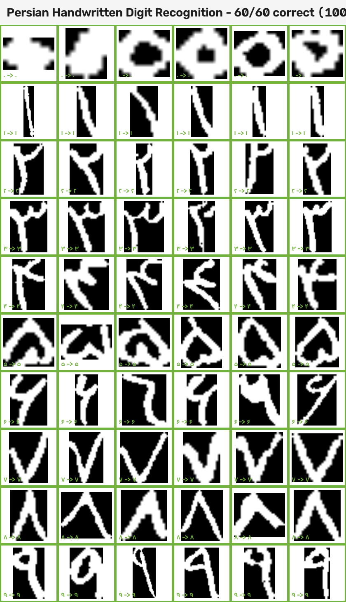

# Persian Digit OCR —  تشخیص ارقام فارسی (دستنویس و کپچا)

[](https://github.com/mehdinmz/Persian-CAPTCHA-OCR/actions/workflows/ci.yml)
[](LICENSE)
[](https://www.python.org/)
[](https://www.tensorflow.org/)

**🌐 [English](README.md) | [فارسی](README.fa.md)**

A complete OCR pipeline for **Persian (Farsi) handwritten digits and CAPTCHAs** — `۰۱۲۳۴۵۶۷۸۹` — built with TensorFlow/Keras and OpenCV.

**99.8% accuracy** on real handwritten Persian digits.

---

## ✨ Highlights

- 🏆 **99.8% accuracy** on real handwritten Persian digits (80k-image dataset)
- 🧠 CNN classifier (TensorFlow/Keras), fine-tuned from synthetic → real data
- 🔍 Robust digit segmentation (OpenCV contours + morphological preprocessing)
- 🎨 Synthetic CAPTCHA generator with 20+ Persian fonts
- 📦 Installable package with CLI (`captcha-ocr`)
- ✅ Automated tests + GitHub Actions CI
- 🔬 Confusion-matrix analysis & evaluation tooling

---

## 📊 Results

| Task | Accuracy |
|------|----------|
| **Handwritten digit classification** (real data) | **99.8%** |
| CAPTCHA digit classification (synthetic, BYekan font) | **100%** |
| Full CAPTCHA solving (5 digits, synthetic) | **100%** |

<details>
<summary><b>Per-class handwritten accuracy</b> (200 images per class)</summary>

| Class | Accuracy |
|-------|----------|
| ۰ | 100.0% |
| ۱ | 99.5% |
| ۲ | 100.0% |
| ۳ | 99.5% |
| ۴ | 100.0% |
| ۵ | 100.0% |
| ۶ | 100.0% |
| ۷ | 100.0% |
| ۸ | 100.0% |
| ۹ | 99.5% |

</details>

**Live predictions on real handwritten digits** (green = correct):



---

## 🚀 Quick Start

### Install

```bash
pip install -e .
```

### Use the CLI

```bash
# Solve a CAPTCHA image
captcha-ocr path/to/captcha.png

# Show per-digit confidence
captcha-ocr path/to/captcha.png --conf
```

### Use as a library

```python
from src.pipeline import predict_captcha, predict_digit

# Full CAPTCHA image → text
text = predict_captcha("path/to/captcha.png")
print(text)  # "۵۲۶۰۱"

# Single digit image → (digit, confidence)
digit, conf = predict_digit("path/to/digit.png")
print(digit, f"{conf:.1%}")
```

### Train / evaluate

```bash
# Train the handwritten-digit model (uses data/dataset_farsi)
python src/train_handwritten.py --epochs 30

# Evaluate the pipeline on a test set
python src/evaluate.py

# Run the automated tests
python -m pytest tests/ -v
```

---

## 🗂 Project Structure

```
.
├── src/                      # Core library & tools
│   ├── model.py              # CNN architecture
│   ├── pipeline.py           # End-to-end prediction (image → text)
│   ├── predictor.py          # Single-digit prediction + CLI
│   ├── preprocessing.py      # Binarization / thresholding
│   ├── segmentation.py       # Digit segmentation (contours)
│   ├── captcha_generator.py  # Synthetic CAPTCHA generator
│   ├── train_handwritten.py  # Train on real handwritten digits
│   ├── finetune_captcha.py   # Fine-tune on CAPTCHA crops
│   ├── evaluate.py           # Accuracy evaluation
│   ├── confusion_analysis.py # Confusion-matrix analysis
│   └── ...                   # Data building & augmentation tools
├── tests/                    # Automated tests (pytest)
├── notebooks/                # Jupyter notebooks (exploration → deployment)
├── data/
│   └── ...                   # Generated synthetic datasets (gitignored)
│                             # Real digits: hosted on HuggingFace (Mehdinmz/persian-handwritten-digits)
├── models/                   # Trained model checkpoints
├── fonts/persian/            # 70+ Persian fonts for synthesis
├── .github/workflows/ci.yml  # GitHub Actions CI
└── pyproject.toml            # Package definition (MIT)
```

---

## 🔬 How It Works

```
CAPTCHA image
    │
    ▼
┌─────────────────┐    ┌──────────────────┐    ┌──────────────────────┐
│  Preprocessing  │ →  │   Segmentation    │ →  │  Digit Classification │
│  (binarize,     │    │  (contours,       │    │  (CNN, 10 classes)    │
│   denoise)      │    │   morphological)  │    │                       │
└─────────────────┘    └──────────────────┘    └──────────────────────┘
                                                    │
                                                    ▼
                                              "۵۲۶۰۱" (text)
```

**1. Preprocessing** — split channels, keep near-black pixels (the digits), remove noise with morphological open/close.

**2. Segmentation** — find digit contours, sort left-to-right, crop each digit with padding.

**3. Classification** — resize each crop to 28×28, normalize, classify with a CNN (Conv2D → MaxPool → Dense → Softmax, 10 classes).

**4. Evaluation** — digit-level and CAPTCHA-level accuracy, confusion matrix per digit.

---

## 🧠 Models

The **default model** is `models/digit_classifier_handwritten.keras` — a CNN trained from scratch on 80k real handwritten Persian digits.

| Model | Description |
|-------|-------------|
| `digit_classifier_handwritten.keras` | **Default** — trained on real handwritten digits (99.8%) |
| `digit_classifier_multifont.keras` | Fine-tuned on synthetic multi-font CAPTCHA crops |

**Why the font matters:** the original CAPTCHA generator used `BNazanin`, which renders the Persian digit `۰` as a tiny dot instead of a full ring — crippling accuracy. Switching to `BYekan` (which renders all digits fully) plus training on real crops took CAPTCHA accuracy from **30% → 100%**.

---

## 📓 Notebooks

| Notebook | Purpose |
|----------|---------|
| `01_explore_dataset.ipynb` | Dataset overview (10 classes, 28×28, 80k images) |
| `02_training.ipynb` | Train the base CNN |
| `03_segmentation_test.ipynb` | Test segmentation on real CAPTCHAs |
| `04_prediction_pipeline.ipynb` | Assemble the end-to-end pipeline |
| `05_fine_tuning.ipynb` | Fine-tune on real Persian digit images |

---

## 🛠 Development

### Run tests locally

```bash
pip install pytest
python -m pytest tests/ -v
```

### CI

Every push to `main` runs the test suite on GitHub Actions (Ubuntu, Python 3.11). A green badge means the pipeline is healthy.

---

## 🤗 Hugging Face

| Artifact | Link |
|----------|------|
| **Dataset** (80k handwritten digits) | [Mehdinmz/persian-handwritten-digits](https://huggingface.co/datasets/Mehdinmz/persian-handwritten-digits) |
| **Model** (CNN, 99.8%) | [Mehdinmz/persian-handwritten-digit-recognition](https://huggingface.co/Mehdinmz/persian-handwritten-digit-recognition) |

```python
from huggingface_hub import hf_hub_download
import tensorflow as tf

path = hf_hub_download("Mehdinmz/persian-handwritten-digit-recognition",
                       "digit_classifier_handwritten.keras")
model = tf.keras.models.load_model(path)
```

---

## 📄 License

[MIT](LICENSE) © 2026 Mohammad Mehdi Namazian
